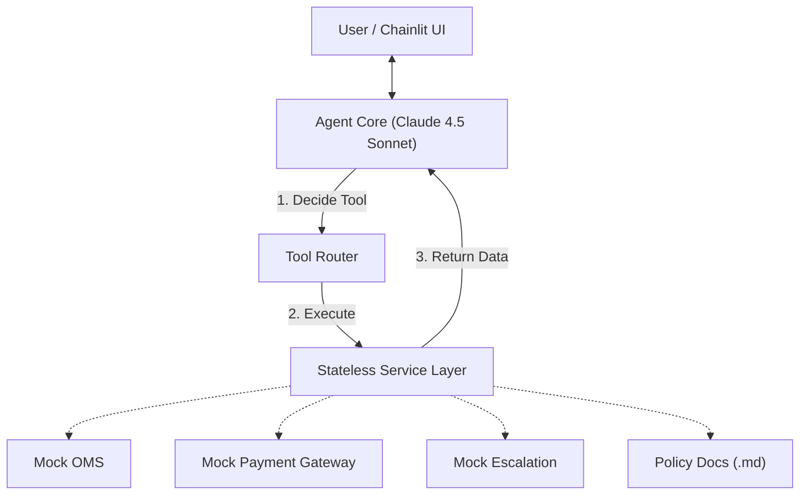

# Enterprise CX Agent (Demo)

> A proof-of-concept demonstration of a **Deterministic AI Workflow** designed for Enterprise Customer Experience (CX).

## ⚠️ Disclaimer
**This repository is for demonstration purposes only.**
It is designed to showcase architectural patterns (State Machines, Tool Use, Guardrails) rather than production-grade infrastructure. It currently mocks backend services and lacks enterprise security features (Authentication, Rate Limiting, Persistent Storage).

---

## 🎯 Project Goal
This project demonstrates how to solve the "Black Box" problem in Generative AI. Instead of a chaotic chatbot, this agent functions as a **State-Based Workflow Engine**. It adheres to a strict Standard Operating Procedure (SOP) to ensure:
1.  **Determinism:** It follows business logic (e.g., "Check eligibility *before* refunding").
2.  **Actionability:** It executes specific mock backend processes, not just chat.
3.  **Safety:** It detects risk (e.g., angry sentiment) and escalates to humans immediately.
4.  **Governance:** It enforces complex compliance rules (via Policy-as-Code) that override basic database flags.

---

## 🏗 Architecture

The system is built using a **Headless Agent** pattern with a decoupled frontend and a **RAG-Lite** layer for policy retrieval.



### Key Technical Decisions

* **Policy-as-Code (RAG-Lite):** Complex rules are moved out of Python logic and into `policies/*.md` files. The Agent retrieves these on-demand to resolve conflicts (e.g., "Database says eligible, but Policy says specific item is non-returnable").
* **Stateless Services (`@staticmethod`):** The Service Layer (`services.py`) is purely functional. It holds no memory, preventing "state drift."
* **Configuration Management:** Model parameters (Temperature=0.0) and System Prompts are decoupled in `config.py` to allow for A/B testing.
* **Structured Logging:** Deep visibility into the "Agent's Brain" via terminal logs, auditing every decision and tool call.

---

## ⚡️ Quick Start

### 1. Prerequisites

* Python 3.10+
* An Anthropic API Key

### 2. Installation

```bash
# Clone the repo
git clone https://github.com/yourusername/enterprise-cx-agent.git
cd enterprise-cx-agent

# Install dependencies
pip install -r requirements.txt

```

### 3. Configuration

Create a `.env` file in the root directory:

```text
ANTHROPIC_API_KEY=sk-ant-api03-......

```

### 4. Run the Agent

```bash
chainlit run app.py -w

```

The UI will open at `http://localhost:8000`.

---

## 🧪 Demo Scenarios

Use these inputs to test the **Guardrails**, **Tool Use**, and **Policy Enforcement** capabilities.

### Scenario A: The Happy Path (Successful Refund)

> **Context:** A standard request compliant with policy.

1. **User:** "I want to return my order."
2. **Agent:** "Sure, what is the order ID?"
3. **User:** `ORD-123`
4. **Agent:** (Checks OMS) "Thank you! I've looked up your order ORD-123. I can see you ordered **Wireless Headphones** and the order has been shipped.

    Before I proceed with your return, I need to verify our return policy and ask you a few questions:

    (1) **What is the reason for your return?** (e.g., defective, changed mind, wrong item, etc.)
    (2) **Have you opened or used the headphones?**

    Let me also pull up our official return policy to ensure we can process this correctly."
5. **User:** "Order received to late. We missed the party and need to return it.
I have note opened it- its still in its packing."
6. **Agent:** (Executes Refund) "Refund processed."

### Scenario B: The Policy Guardrail (Database Rejection)

> **Context:** The agent refuses a request because the database flag says "Eligible: False".

1. **User:** "I want to return order `ORD-456`."
2. **Agent:** (Checks OMS -> Sees `eligible_for_return: False`) "I cannot process this. The return window has expired."

### Scenario C: The Safety Valve (Escalation)

> **Context:** High-risk sentiment detection.

1. **User:** "I am absolutely furious about order `ORD-999`! This is a scam!"
2. **Agent:** (Detects Anger -> Triggers Escalation Tool) "I have escalated this to a human agent immediately. Ticket TKT-555 created."

### Scenario D: The Governance Override (Policy Wins)

> **Context:** The database says "Eligible", but the specific item violates a strict category rule in `return_policy.md` (e.g., Hygiene/Digital).

1. **User:** "I want to return `ORD-777` (Socks)."
2. **Agent:** (Checks OMS -> Sees `Eligible: True`)
3. **Agent:** (Reads `return_policy.md`) "Wait, the policy states socks are **Final Sale**."
4. **Agent:** "I cannot return these. For hygiene reasons, socks are non-returnable despite being within the time window."