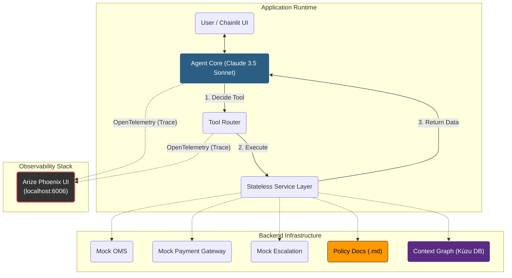

# Enterprise CX Agent (Demo)

> A proof-of-concept demonstration of a **Deterministic AI Workflow** designed for Enterprise Customer Experience (CX).

## ⚠️ Disclaimer
**This repository is for demonstration and interview purposes only.**
It is designed to showcase architectural patterns (State Machines, Tool Use, Guardrails, Graph RAG) rather than production-grade infrastructure. It currently mocks backend services and lacks enterprise security features.

---

## 🎯 Project Goal
This project demonstrates how to solve the "Black Box" problem in Generative AI. Instead of a chaotic chatbot, this agent functions as a **State-Based Workflow Engine**. It adheres to a strict Standard Operating Procedure (SOP) to ensure:
1.  **Determinism:** It follows business logic (e.g., "Check eligibility *before* refunding").
2.  **Safety:** It detects risk (e.g., angry sentiment) and escalates to humans immediately.
3.  **Governance:** It enforces complex compliance rules (via Policy-as-Code) that override basic database flags.
4.  **Adaptability (New):** It uses a **Context Graph** to apply "Case Law"—allowing nuanced exceptions (e.g., VIPs, Holidays) based on historical human precedents.

---

## 🏗 Architecture

The system is built using a **Headless Agent** pattern with a decoupled frontend, a **RAG-Lite** layer for policies, and an embedded **Graph Database** for historical decision tracing.





### Key Technical Decisions

* **Precedent-Based Governance (Context Graph):** Implemented an embedded **Kùzu Graph Database** to solve the "Rigid Rule" problem.
* *Problem:* Hard-coded policies (e.g., "No Returns on Socks") annoy VIP customers.
* *Solution:* The Agent queries the Graph for "Exceptions" (e.g., `VIP + Socks`). If a human has approved a similar case in the past, the Agent autonomously grants the exception, citing the precedent.


* **Tri-Layered Governance:** Compliance is enforced at three levels:
1. **Prompt:** Explicit "Override Protocol" (Text > Database).
2. **Data:** "Active Enforcement" language in Markdown policies (`ACTION: REJECT`).
3. **Tool Constraints:** The `execute_refund` tool requires a mandatory `policy_check_confirmation` argument, physically preventing the LLM from calling it without "self-certifying" compliance.


* **Recursive Re-Act Loop:** The Agent runs inside a continuous `while` loop, allowing it to chain multiple reasoning steps (e.g., *Check Policy* -> *Consult Graph* -> *Execute Refund*) in a single turn without "getting stuck."
* **Visual Decision Tracing:** Integrated **Arize Phoenix** via **OpenTelemetry** to visualize the agent's "Chain of Thought" as a waterfall chart.

---

## ⚡️ Quick Start

### 1. Prerequisites

* Python 3.10+
* An Anthropic API Key

### 2. Installation

```bash
# Clone the repo
git clone [https://github.com/yourusername/enterprise-cx-agent.git](https://github.com/yourusername/enterprise-cx-agent.git)
cd enterprise-cx-agent

# Install dependencies
pip install -r requirements.txt

# Initialize the Context Graph (Seeds the DB with exception data)
python scripts/init_graph.py

```

### 3. Configuration

Create a `.env` file in the root directory:

```text
ANTHROPIC_API_KEY=sk-ant-api03-......

```

### 4. Run the Stack (Agent + Observability)

**Terminal 1: Start Arize Phoenix (Observability UI)**

```bash
python -m phoenix.server.main serve

```

*The Dashboard will be available at `http://localhost:6006`.*

**Terminal 2: Run the Agent**

```bash
chainlit run app.py -w

```

*The Chat UI will open at `http://localhost:8000`.*

---

## 🧪 Demo Scenarios

Use these inputs to test the **Guardrails**, **Tool Use**, and **Context Graph** capabilities.

### 1. The Standard Controls (Basics)

**Scenario A: The Happy Path (Successful Refund)**

* **User:** "I want to return my order ORD-123 (Headphones)."
* **Outcome:** **Refunded.** Agent checks OMS, verifies policy, and processes refund.

**Scenario B: The Database Rejection**

* **User:** "I want to return order ORD-456."
* **Outcome:** **Denied.** Agent sees `eligible_for_return: False` in the database (OMS) and rejects immediately.

**Scenario C: The Safety Valve (Escalation)**

* **User:** "I am absolutely furious about order ORD-999! This is a scam!"
* **Outcome:** **Escalated.** Agent detects angry sentiment/keywords and triggers the Zendesk handover tool immediately.

### 2. The Advanced Governance (Policy vs. Database)

**Scenario D: The Governance Override (Policy Wins)**

> *Context: Database says "Eligible", but Policy says "No".*

* **User:** "I want to return ORD-777 (Socks)."
* **Outcome:** **Denied.** Agent reads `return_policy.md`, sees "Socks are Final Sale", and overrides the database eligibility flag.

### 3. The Context Graph (AI Adaptability)

**Scenario E: The "VIP Loyalty" Exception**

> *Context: Socks are Final Sale, but User is VIP.*

* **User:** "I want to return these socks (ORD-777). I know they are final sale, but I am a **VIP** customer and I need an exception."
* **Outcome:** **Approved.** Agent queries the Graph, finds a "VIP Loyalty" precedent, and grants a one-time courtesy refund.

**Scenario F: The "Holiday Gift" Exception**

> *Context: Return is late (45 days), but it was a Holiday Gift.*

* **User:** "I want to return order ORD-888. It was a **holiday gift** I bought in December, so I'm returning it a bit **late**."
* **Outcome:** **Approved.** Agent queries the Graph, finds the "Holiday Extension" precedent (allowing 60 days), and approves the return.

**Scenario G: The "High Value" Tech Exception**

> *Context: Opened Electronics are usually denied.*

* **User:** "I bought this Gaming Monitor (ORD-999). I **opened** it, but I don't like it. I am a **High Value** customer who spends $10k a year here."
* **Outcome:** **Approved.** Agent queries the Graph, finds a precedent for "High Value Customer / Opened Tech", and grants the exception.

---

## 🔬 Inspecting Decisions

After running any scenario, go to `http://localhost:6006` to inspect the trace:

1. Click on the **Traces** tab.
2. Select the most recent trace to see the **Waterfall View**.
3. Verify the sequence: `User Input` -> `LLM Thought` -> `Tool Call (check_precedents)` -> `Tool Output` -> `Final Response`.
