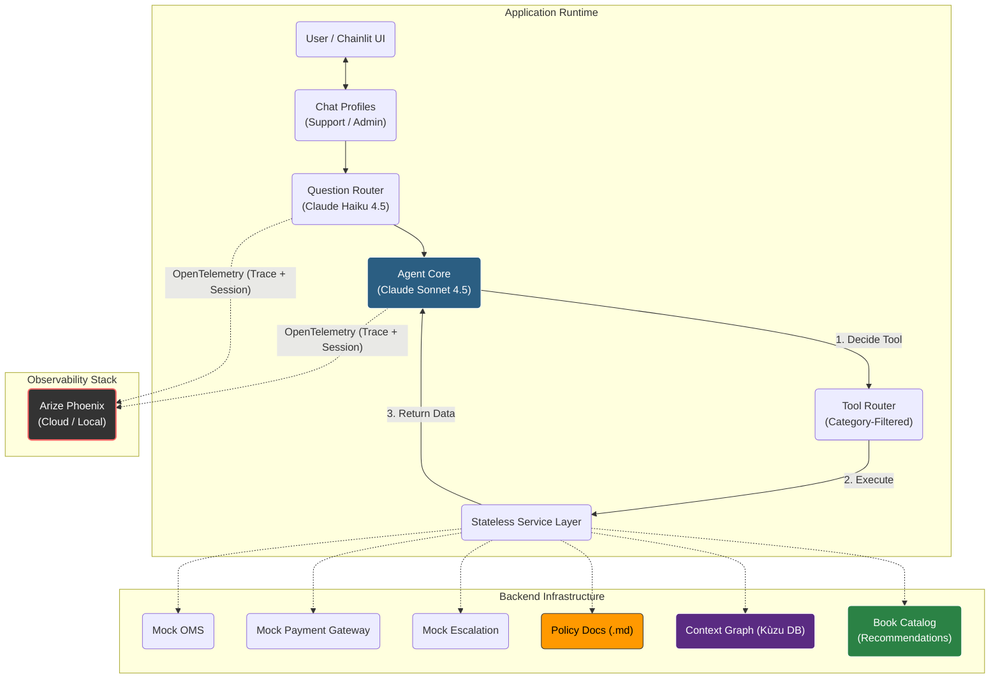
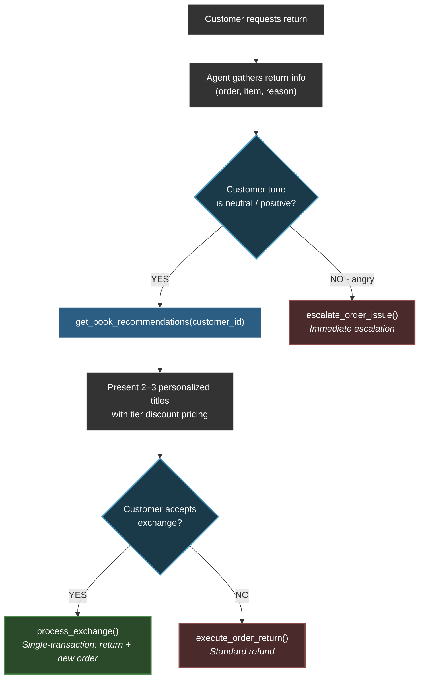

# Bookly - AI-Powered Bookshop Assistant (Demo)

> A proof-of-concept demonstration of a **Deterministic AI Workflow** designed for Enterprise Customer Experience (CX) in an online bookshop.

## ⚠️ Disclaimer
**This repository is for demonstration and interview purposes only.**
It is designed to showcase architectural patterns (State Machines, Tool Use, Guardrails, Graph RAG, Intelligent Routing, Upsell Motion) rather than production-grade infrastructure. It currently mocks backend services and lacks enterprise security features.

---

## 🎯 Project Goal
This project demonstrates how to solve the "Black Box" problem in Generative AI. Instead of a chaotic chatbot, this agent functions as a **State-Based Workflow Engine with Intelligent Routing**. It adheres to a strict Standard Operating Procedure (SOP) to ensure:
1.  **Determinism:** It follows business logic (e.g., "Check eligibility *before* refunding").
2.  **Safety:** It detects risk (e.g., angry sentiment) and escalates to humans immediately.
3.  **Governance:** It enforces complex compliance rules (via Policy-as-Code) that override basic database flags.
4.  **Adaptability:** It uses a **Context Graph** to apply "Case Law"—allowing nuanced exceptions (e.g., VIPs, Holidays) based on historical human precedents.
5.  **Intelligent Routing:** It automatically classifies user questions into categories (Order Status, Returns/Refunds, General Questions) for optimized handling.
6.  **Upsell Motion:** It offers personalized book recommendations during the return workflow, converting returns into exchanges and increasing customer lifetime value.

---

## 🏗 Architecture

The system is built using a **Headless Agent** pattern with a decoupled frontend, **intelligent question routing**, a **RAG-Lite** layer for policies, an embedded **Graph Database** for historical decision tracing, and a **personalized recommendation engine** for upsell.


```mermaid
graph TD
    %% --- Subgraph: Application Runtime ---
    subgraph App [Application Runtime]
        User("User / Chainlit UI") <--> Profiles("Chat Profiles<br/>(Support / Admin)")
        Profiles --> Router("Question Router<br/>(Claude Haiku 4.5)")
        Router --> Agent("Agent Core<br/>(Claude Sonnet 4.5)")
        Agent -- "1. Decide Tool" --> ToolRouter("Tool Router<br/>(Category-Filtered)")
        ToolRouter -- "2. Execute" --> Services("Stateless Service Layer")
        Services -- "3. Return Data" --> Agent
    end

    %% --- Subgraph: Backend Services ---
    subgraph Backends [Backend Infrastructure]
        Services -.-> OMS("Mock OMS")
        Services -.-> Stripe("Mock Payment Gateway")
        Services -.-> Zendesk("Mock Escalation")
        Services -.-> Policies("Policy Docs (.md)")
        Services -.-> Graph("Context Graph (Kùzu DB)")
        Services -.-> Books("Book Catalog<br/>(Recommendations)")
    end

    %% --- Subgraph: Observability ---
    subgraph Observability [Observability Stack]
        Phoenix("Arize Phoenix<br/>(Cloud / Local)")
    end

    %% --- Telemetry Connections ---
    Agent -.-> |"OpenTelemetry (Trace + Session)"| Phoenix
    Router -.-> |"OpenTelemetry (Trace + Session)"| Phoenix

    %% --- Styling ---
    style Phoenix fill:#333,stroke:#f66,stroke-width:2px,color:#fff
    style Agent fill:#2b5e82,stroke:#fff,color:#fff
    style Policies fill:#ff9900,stroke:#333,color:#000
    style Graph fill:#5a2b82,stroke:#fff,color:#fff
    style Books fill:#2b8245,stroke:#fff,color:#fff
```

---

### Key Technical Decisions

* **Intelligent Question Routing:** Implemented a **dual-model architecture** for cost optimization:
  * *Router Layer:* Uses **Claude Haiku 4.5** (20x cheaper) to classify questions into 3 categories:
    1. **Order Status** — Tracking and delivery inquiries
    2. **Returns/Refunds** — Return processing and refund requests
    3. **General** — Policy questions, account help, FAQs
  * *Agent Layer:* Uses **Claude Sonnet 4.5** for complex reasoning and decision-making
  * *Result:* Better organization, specialized handling, and scalable architecture

* **Category-Specific Prompts & Tools:** Each question category receives a dedicated system prompt and a filtered subset of tools, reducing token usage and improving accuracy.

* **Book Recommendation Engine & Upsell Motion:** When a customer initiates a return, the agent proactively offers personalized book recommendations *before* processing the refund, creating an upsell opportunity:
  * **3-Tier Algorithm:** (1) Books by authors the customer rated 4+ stars, (2) top-rated books in favorite genres, (3) popular books in similar genres.
  * **Tier-Based Discounts:** Silver 10%, Gold 15%, Platinum 25% off.
  * **Automatic Exchange:** Single-transaction tool (`process_exchange`) handles return + new order simultaneously, including price difference settlement and VIP benefits.

* **Precedent-Based Governance (Context Graph):** Implemented an embedded **Kùzu Graph Database** to solve the "Rigid Rule" problem.
  * *Problem:* Hard-coded policies (e.g., "No Returns on Opened Books") frustrate VIP customers.
  * *Solution:* The Agent queries the Graph for "Exceptions" (e.g., `VIP + Opened Books`). If a human has approved a similar case in the past, the Agent autonomously grants the exception, citing the precedent.

* **Tri-Layered Governance:** Compliance is enforced at three levels:
  1. **Prompt:** Explicit "Override Protocol" (Text > Database).
  2. **Data:** "Active Enforcement" language in Markdown policies (`ACTION: REJECT`).
  3. **Tool Constraints:** The `execute_order_return` tool requires a mandatory `reason` argument, physically preventing the LLM from calling it without confirming the return rationale.

* **Recursive Re-Act Loop:** The Agent runs inside a continuous `while` loop, allowing it to chain multiple reasoning steps (e.g., *Check Policy* → *Consult Graph* → *Execute Refund*) in a single turn without "getting stuck."

* **Dual Escalation Routing:** Two specialized escalation tools supplement the generic `escalate_to_human`:
  * `escalate_order_issue` — Routes to Order Support with 2–4 hour SLA (used when there is an order ID in context).
  * `escalate_general_question` — Routes to General Support with 24-hour SLA (used for policy, account, or technical questions).

* **Visual Decision Tracing:** Integrated **Arize Phoenix** via **OpenTelemetry** to visualize the agent's "Chain of Thought" as a waterfall chart, with full session tracking in Phoenix Cloud.

---

## 🎯 Question Routing

Every incoming message is classified by Haiku into one of three categories before the Sonnet agent handles it. Each category gets a dedicated system prompt and filtered tool set.

| Category | Example inputs |
|----------|---------------|
| `ORDER_STATUS` | "Where is my order?", "Has my package shipped?" |
| `RETURNS_REFUNDS` | "I want to return this book", "How do I get a refund?" |
| `GENERAL` | "What's your shipping policy?", "Do you sell audiobooks?", "How do I reset my password?" |

Router: `router/router.py` — `QuestionRouter` class, `QuestionCategory` enum.

---

## 📚 Recommendation Engine & Upsell Motion

### Business Goals

1. **Primary:** Prevent returns by offering compelling alternatives before processing the refund.
2. **Secondary:** Convert returns into exchanges, maintaining revenue and increasing basket size.
3. **Tertiary:** Leverage VIP tier discounts to increase customer loyalty and lifetime value.

### Workflow


```mermaid
flowchart TD
    A["Customer requests return"]
    B["Agent gathers return info<br/>(order, item, reason)"]
    C{"Customer tone<br/>is neutral / positive?"}
    D["get_book_recommendations(customer_id)"]
    E["Present 2–3 personalized titles<br/>with tier discount pricing"]
    F{"Customer accepts<br/>exchange?"}
    G["process_exchange()<br/><em>Single-transaction: return + new order</em>"]
    H["execute_order_return()<br/><em>Standard refund</em>"]
    I["escalate_order_issue()<br/><em>Immediate escalation</em>"]

    A --> B
    B --> C
    C -->|YES| D
    C -->|NO - angry| I
    D --> E
    E --> F
    F -->|YES| G
    F -->|NO| H

    style A fill:#333,stroke:#aaa,color:#fff
    style B fill:#333,stroke:#aaa,color:#fff
    style C fill:#1a3a4a,stroke:#4a9eca,stroke-width:2px,color:#fff
    style D fill:#2b5e82,stroke:#fff,color:#fff
    style E fill:#333,stroke:#aaa,color:#fff
    style F fill:#1a3a4a,stroke:#4a9eca,stroke-width:2px,color:#fff
    style G fill:#2a4a2a,stroke:#4a8a4a,stroke-width:2px,color:#fff
    style H fill:#4a2a2a,stroke:#8a4a4a,stroke-width:2px,color:#fff
    style I fill:#4a2a2a,stroke:#8a4a4a,stroke-width:2px,color:#fff
```

### 3-Tier Recommendation Algorithm

| Rule | Signal | Example |
|------|--------|---------|
| 1 | Authors customer rated ≥ 4 stars | Lee Child books for a Reacher fan |
| 2 | Top-rated books in favourite genres | 4.5+ star Thrillers for a Thriller fan |
| 3 | Popular books in similar genres | Trending Crime for a Thriller fan |

Already-purchased books are excluded from all tiers.

### Tier-Based Discounts

| VIP Tier | Discount |
|----------|----------|
| Platinum | 25% off |
| Gold | 15% off |
| Silver | 10% off |
| Regular | 0% (still gets recommendations) |

### Automatic Exchange Tool

`process_exchange(original_order_id, new_book_id, new_book_title, customer_id, return_reason)` — handles:

- Return of original order (refund transaction)
- New order placement for selected book (reusing delivery address on file)
- Price difference charge/credit to card on file
- VIP discount applied to new order
- Delivery estimate (3–5 business days)
- Full audit trail in decision ledger

---

## 🔭 Observability — Arize Phoenix Cloud

### Overview

All agent traces — question classification, tool calls, reasoning steps, and final responses — are sent to **Arize Phoenix** via **OpenTelemetry**. Both cloud and local modes are supported.

### Phoenix Cloud (Recommended)

When `PHOENIX_SPACE_ID` and `PHOENIX_API_KEY` are set in `.env`, the agent registers with **Arize Phoenix Cloud** (`app.phoenix.arize.com`) using the `arize-otel` SDK:

```python
from arize.otel import register
tracer_provider = register(space_id=..., api_key=..., project_name=...)
```

All traces appear in the Phoenix Cloud dashboard under the configured project name.

### Local Phoenix (Fallback)

If no cloud credentials are set, traces are sent to a local Phoenix instance at `http://localhost:6006`.

### Session Tracking

Every conversation generates a unique **session ID** (`SESSION-{uuid.hex[:8]}`). This ID is:
- Attached as `session_id` attribute on all OpenTelemetry spans
- Included in every JSON audit log event
- Passed to both the Router and the Agent so Phoenix Cloud can group all turns of a conversation under a single **Session** in the UI

This means you can inspect a complete customer conversation — classification → tool calls → agent reasoning → response — in a single session timeline in Phoenix.

### Instrumentation

`AnthropicInstrumentor().instrument(tracer_provider=tracer_provider)` automatically wraps every `client.messages.create()` call with trace spans, with zero additional code required.

---

## 💬 Chat Profiles

The Chainlit UI exposes two profiles:

| Profile | Purpose |
|---------|---------|
| **Bookly Support** | Customer-facing agent for orders, returns, and general enquiries |
| **Bookly Admin** | Internal decision trace viewer — enter a Session ID to replay all agent decisions, precedent matches, and tool calls for any past conversation |

---

## ⚡️ Quick Start

### 1. Prerequisites

* Python 3.10+
* An Anthropic API Key
* (Optional) Arize Phoenix Cloud account for cloud observability

### 2. Installation

```bash
# Clone the repo
git clone https://github.com/nitinNayar/enterprise-cx-agent.git
cd enterprise-cx-agent

# Install dependencies
pip install -r requirements.txt

# Initialize the Context Graph (seeds the DB with exception precedent data)
python scripts/init_graph.py
```

### 3. Configuration

Create a `.env` file in the root directory:

```text
# Required
ANTHROPIC_API_KEY=sk-ant-api03-......

# Optional: Arize Phoenix Cloud (leave blank to use local Phoenix instead)
PHOENIX_API_KEY=ak-...
PHOENIX_SPACE_ID=U3BhY2U6...
PHOENIX_PROJECT_NAME=enterprise-cx-agent
```

### 4. Run the Stack

**Option A — Phoenix Cloud (no extra terminal needed)**

```bash
chainlit run app.py -w
```

Traces are automatically sent to Phoenix Cloud. The Chat UI is at `http://localhost:8000`.

**Option B — Local Phoenix**

**Terminal 1: Start Arize Phoenix (Observability UI)**

```bash
python -m phoenix.server.main serve
```

*The dashboard will be available at `http://localhost:6006`.*

**Terminal 2: Run the Agent**

```bash
chainlit run app.py -w
```

*The Chat UI will open at `http://localhost:8000`.*

---

## 🎬 System Overview

**📹 [Watch the Full System Walkthrough (5 min)](https://www.loom.com/share/da571310a7074dc596d399b6c837b9df)**
This video covers the complete architecture, including State Machine design, Tool Use, Guardrails, Context Graphs, Observability stack, and the Recommendation / Upsell workflow.

---

## 🧪 Demo Scenarios

Use these inputs to test **Question Routing**, **Guardrails**, **Tool Use**, **Context Graph**, **Recommendations**, and **Exchanges**.

### 0. Testing Question Routing

**Scenario R1: Order Status Query**
* **User:** "Where is my order ORD-123?"
* **Router Classification:** ORDER_STATUS
* **Outcome:** Agent focuses on order tracking and delivery information using `look_up_order` + `get_customer_info`

**Scenario R2: Return Request**
* **User:** "I want to return the book I just bought"
* **Router Classification:** RETURNS_REFUNDS
* **Outcome:** Agent initiates full return workflow including policy check and recommendation offer

**Scenario R3: General Question**
* **User:** "What's your shipping policy for international orders?"
* **Router Classification:** GENERAL
* **Outcome:** Agent retrieves shipping policy via `get_policy_info`

---

### 1. The Standard Controls (Basics)

**Scenario A: The Happy Path (Successful Refund)**
* **User:** "I want to return my order ORD-123 (The Great Gatsby hardcover)."
* **Router:** RETURNS_REFUNDS
* **Outcome:** **Refunded.** Agent checks OMS, greets customer by name, verifies policy (book unread, within 30 days), offers recommendations, then processes refund.

**Scenario B: The Database Rejection**
* **User:** "I want to return order ORD-456 (1984 paperback)."
* **Router:** RETURNS_REFUNDS
* **Outcome:** **Denied.** Agent sees `eligible_for_return: False` in the database (late return) and rejects immediately.

**Scenario C: The Safety Valve (Escalation)**
* **User:** "I am absolutely furious about order ORD-999! This is a scam!"
* **Router:** RETURNS_REFUNDS → immediate escalation
* **Outcome:** **Escalated.** Agent detects angry sentiment and triggers `escalate_order_issue` immediately — no recommendations offered.

---

### 2. The Advanced Governance (Policy vs. Database)

**Scenario D: The Governance Override (Policy Wins)**

> *Database says "Eligible", but Policy says "No".*

* **User:** "I want to return ORD-777 (Digital audiobook that I downloaded)."
* **Router:** RETURNS_REFUNDS
* **Outcome:** **Denied.** Agent reads `return_policy.md`, finds "Digital products are non-returnable once downloaded", and overrides the database eligibility flag.

**Scenario E: The Read Book Return**
* **User:** "I want to return this book but I've already read it."
* **Router:** RETURNS_REFUNDS
* **Outcome:** **Denied.** Policy requires books to be in "unread, resellable condition". Agent explains policy.

---

### 3. The Context Graph & Decision Traces (AI Adaptability)

**Scenario F: The "Book Club VIP" Exception**

> *Book has been read, but customer is VIP.*

* **User:** "I want to return this novel (ORD-777). I know I've read it, but I'm a **Book Club Platinum VIP** member for 5 years."
* **Router:** RETURNS_REFUNDS
* **Outcome:** **Approved.** Agent queries the Graph, finds a "VIP Loyalty" precedent for Book Club members, and grants a one-time courtesy refund, citing conditions from the precedent.

**Scenario G: The "Holiday Gift" Exception**

> *Return is late (45 days), but it was a Holiday Gift.*

* **User:** "I want to return order ORD-888 (Gift set of books). It was a **holiday gift** I bought in December, so I'm returning it a bit **late**."
* **Router:** RETURNS_REFUNDS
* **Outcome:** **Approved.** Agent queries the Graph, finds the "Holiday Extension" precedent (allowing 60 days), and approves the return.

**Scenario H: The "Signed Edition" Exception**

> *Opened collectible books are usually denied.*

* **User:** "I bought this **signed first edition** (ORD-999). I **opened** it to verify the signature, but now I want to return it. I'm a **high-value collector** who spends $5k a year here."
* **Router:** RETURNS_REFUNDS
* **Outcome:** **Approved with conditions.** Agent queries the Graph, finds a precedent for "High Value Collector / Opened Signed Edition", and grants the exception with specific return conditions.

---

### 4. Recommendation Engine & Exchange

**Scenario I: The Upsell Exchange**

> *Customer wants to return a book but might love a different one.*

* **User:** "I want to return order ORD-123. The story wasn't what I expected."
* **Outcome:** After verifying return eligibility and gathering information, agent offers 2–3 personalised alternatives with tier discount. If customer accepts: `process_exchange()` runs in one transaction — no separate return/re-order needed. If customer declines: standard refund is processed.

**Scenario J: Angry Customer — No Upsell**
* **User:** "I demand a refund immediately! This is unacceptable!"
* **Outcome:** Agent detects negative tone and skips recommendations entirely, routing straight to `escalate_order_issue`.

---

## 🔬 Inspecting Decisions

### Phoenix Cloud

After running any scenario, go to **[app.phoenix.arize.com](https://app.phoenix.arize.com)** and open your project:
1. Click the **Sessions** tab to see conversations grouped by `SESSION-xxxxxxxx` ID.
2. Click a session to see the full conversation timeline.
3. Click any span to see the **Waterfall View**: `User Input` → `Router Classification` → `LLM Thought` → `Tool Call` → `Tool Output` → `Final Response`.

### Local Phoenix

Go to `http://localhost:6006` and navigate to the **Traces** tab.

### Admin Decision Reviewer

Switch to the **Bookly Admin** chat profile and enter a Session ID (format: `SESSION-xxxxxxxx`) to replay all audit-logged events for that session:

- User messages & agent responses
- Every tool call and its result
- Precedent queries and matches
- Final agent decision with attribution
- VIP tier and conditions applied

---

## 🛠 Tool Reference

| Tool | Category | Purpose |
|------|----------|---------|
| `look_up_order` | All | Fetch order details — mandatory first step |
| `get_customer_info` | All | Personalised greeting, VIP tier, reading preferences |
| `get_policy_info` | Returns, General | Read returns / shipping / privacy policy markdown |
| `execute_order_return` | Returns | Process refund once all checks pass |
| `check_vip_status` | Returns | Automatic VIP check on any policy denial |
| `check_precedents` | Returns | Query Kùzu graph for human-approved exceptions |
| `get_book_recommendations` | Returns | Personalised book alternatives before refund |
| `process_exchange` | Returns | Return + new order in a single transaction |
| `escalate_order_issue` | Orders, Returns | Order Support team (2–4 hr SLA) |
| `escalate_general_question` | General | General Support team (24 hr SLA) |
| `escalate_to_human` | All | Legacy generic escalation fallback |

---

## 📁 Project Structure

```
enterprise-cx-agent/
├── app.py                          # Chainlit entry point, chat profiles, routing
├── config.py                       # Model settings (Sonnet 4.5, temp=0)
├── prompts.py                      # Category-specific system prompts (~940 lines)
├── logging_config.py               # Dual logging (console + JSON audit)
├── SETUP_INSTRUCTIONS.md           # Environment setup guide
│
├── agent/
│   └── agent.py                    # SupportAgent — ReAct loop, Arize session context
├── router/
│   └── router.py                   # QuestionRouter — Haiku classification
├── tools/
│   └── tools.py                    # Tool schema definitions (11 tools)
├── services/
│   └── services.py                 # All backend service implementations
├── observability/
│   └── tracing.py                  # Phoenix Cloud / local OTEL setup
├── admin/
│   └── decision_reviewer.py        # Admin session trace interface
│
├── data/
│   ├── context_graph_db/           # Kùzu embedded graph (precedents)
│   ├── mock_orders.json
│   ├── mock_customers.json
│   ├── mock_customers_enhanced.json  # Customers with reading preferences
│   ├── mock_books_catalog.json       # Book catalog for recommendations
│   ├── decision_emails/              # Sample decision email templates
│   └── data_loader.py
│
├── policies/
│   ├── return_policy.md
│   ├── shipping_policy.md
│   ├── privacy_policy.md
│   ├── faq.md
│   └── password_reset.md
│
├── scripts/
│   └── init_graph.py               # Seed Kùzu DB with exception precedents
│
├── tests/                          # Pytest test suites
│   ├── test_session_tracking.py
│   ├── test_router_session_tracking.py
│   ├── test_specialized_routing.py
│   ├── test_decision_ledger.py
│   ├── test_complete_workflow.py
│   ├── test_new_schema.py
│   ├── test_order_id_normalization.py
│   ├── test_return_reason_mandatory.py
│   └── test_timing_validation.py
│
├── docs/                           # Design and implementation documentation
│   ├── AGENT_DESIGN_DOCUMENT.md
│   ├── TECHNICAL_OVERVIEW.md
│   ├── DEMO_GUIDE.md
│   └── ...                         # Implementation notes and bug fix guides
│
├── logs/
│   └── decision_audit.log          # JSON-formatted audit events (JSONL)
│
└── requirements.txt
```

---

## 🔧 Running Tests

```bash
pytest tests/
```

Key test suites:

| Test File | What It Covers |
|-----------|----------------|
| `test_session_tracking.py` | Session ID generation and persistence |
| `test_router_session_tracking.py` | Router passes session context to Arize |
| `test_specialized_routing.py` | Category-specific tool and prompt selection |
| `test_decision_ledger.py` | Audit log event capture and attribution |
| `test_complete_workflow.py` | End-to-end return workflow |
| `test_new_schema.py` | Updated data schema validation |
| `test_order_id_normalization.py` | "ORD 123", "ord_123", etc. → "ORD-123" |
| `test_return_reason_mandatory.py` | Return reason validation before refund |
| `test_timing_validation.py` | 30-day return window enforcement |
