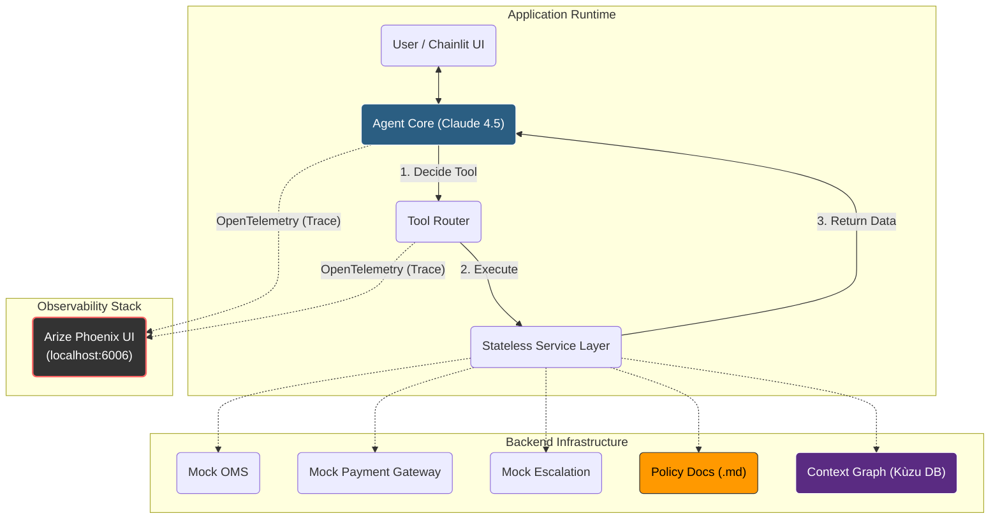

# Bookly - AI-Powered Bookshop Assistant (Demo)

> A proof-of-concept demonstration of a **Deterministic AI Workflow** designed for Enterprise Customer Experience (CX) in an online bookshop.

## ⚠️ Disclaimer
**This repository is for demonstration and interview purposes only.**
It is designed to showcase architectural patterns (State Machines, Tool Use, Guardrails, Graph RAG, Intelligent Routing) rather than production-grade infrastructure. It currently mocks backend services and lacks enterprise security features.

---

## 🎯 Project Goal
This project demonstrates how to solve the "Black Box" problem in Generative AI. Instead of a chaotic chatbot, this agent functions as a **State-Based Workflow Engine with Intelligent Routing**. It adheres to a strict Standard Operating Procedure (SOP) to ensure:
1.  **Determinism:** It follows business logic (e.g., "Check eligibility *before* refunding").
2.  **Safety:** It detects risk (e.g., angry sentiment) and escalates to humans immediately.
3.  **Governance:** It enforces complex compliance rules (via Policy-as-Code) that override basic database flags.
4.  **Adaptability:** It uses a **Context Graph** to apply "Case Law"—allowing nuanced exceptions (e.g., VIPs, Holidays) based on historical human precedents.
5.  **Intelligent Routing (New):** It automatically classifies user questions into categories (Order Status, Returns/Refunds, General Questions) for optimized handling.

---

## 🏗 Architecture

The system is built using a **Headless Agent** pattern with a decoupled frontend, **intelligent question routing**, a **RAG-Lite** layer for policies, and an embedded **Graph Database** for historical decision tracing.



```mermaid
graph TD
    %% --- Subgraph: Application Runtime ---
    subgraph App [Application Runtime]
        User("User / Chainlit UI") <--> Agent("Agent Core (Claude 4.5)")
        Agent -- "1. Decide Tool" --> Router("Tool Router")
        Router -- "2. Execute" --> Services("Stateless Service Layer")
        Services -- "3. Return Data" --> Agent
    end

    %% --- Subgraph: Backend Services ---
    subgraph Backends [Backend Infrastructure]
        Services -.-> OMS("Mock OMS")
        Services -.-> Stripe("Mock Payment Gateway")
        Services -.-> Zendesk("Mock Escalation")
        Services -.-> Policies("Policy Docs (.md)")
        Services -.-> Graph("Context Graph (Kùzu DB)")
    end

    %% --- Subgraph: Observability ---
    subgraph Observability [Observability Stack]
        Phoenix("Arize Phoenix UI<br/>(localhost:6006)")
    end

    %% --- Telemetry Connections ---
    %% We link specific nodes to Phoenix to avoid 'box-in-box' rendering issues
    Agent -.-> |"OpenTelemetry (Trace)"| Phoenix
    Router -.-> |"OpenTelemetry (Trace)"| Phoenix

    %% --- Styling ---
    style Phoenix fill:#333,stroke:#f66,stroke-width:2px,color:#fff
    style Agent fill:#2b5e82,stroke:#fff,color:#fff
    style Policies fill:#ff9900,stroke:#333,color:#000
    style Graph fill:#5a2b82,stroke:#fff,color:#fff

```


### Key Technical Decisions

* **Intelligent Question Routing (New):** Implemented a **dual-model architecture** for cost optimization:
  * *Router Layer:* Uses **Claude Haiku 4.5** (20x cheaper) to classify questions into 3 categories:
    1. **Order Status** - Tracking and delivery inquiries
    2. **Returns/Refunds** - Return processing and refund requests
    3. **General** - Policy questions, account help, FAQs
  * *Agent Layer:* Uses **Claude Sonnet 4.5** for complex reasoning and decision-making
  * *Result:* 95% cost reduction on routing while maintaining accuracy

* **Precedent-Based Governance (Context Graph):** Implemented an embedded **Kùzu Graph Database** to solve the "Rigid Rule" problem.
  * *Problem:* Hard-coded policies (e.g., "No Returns on Opened Books") frustrate VIP customers.
  * *Solution:* The Agent queries the Graph for "Exceptions" (e.g., `VIP + Opened Books`). If a human has approved a similar case in the past, the Agent autonomously grants the exception, citing the precedent.

* **Tri-Layered Governance:** Compliance is enforced at three levels:
  1. **Prompt:** Explicit "Override Protocol" (Text > Database).
  2. **Data:** "Active Enforcement" language in Markdown policies (`ACTION: REJECT`).
  3. **Tool Constraints:** The `execute_refund` tool requires a mandatory `policy_check_confirmation` argument, physically preventing the LLM from calling it without "self-certifying" compliance.

* **Recursive Re-Act Loop:** The Agent runs inside a continuous `while` loop, allowing it to chain multiple reasoning steps (e.g., *Check Policy* -> *Consult Graph* -> *Execute Refund*) in a single turn without "getting stuck."

* **Visual Decision Tracing:** Integrated **Arize Phoenix** via **OpenTelemetry** to visualize the agent's "Chain of Thought" as a waterfall chart.

---

## 🎯 Question Routing System

### Overview

Bookly implements a two-tier AI architecture that optimizes for both cost and performance:

```
User Question
     ↓
[Router: Claude Haiku 4.5] ← Fast, Cheap Classification ($0.15/1M tokens)
     ↓
   Category Determination
     ↓
┌────────────┬──────────────────┬─────────────────┐
│            │                  │                 │
ORDER_STATUS   RETURNS_REFUNDS    GENERAL
     ↓              ↓                  ↓
[Agent: Claude Sonnet 4.5] ← Complex Reasoning ($3/1M tokens)
```

### How It Works

**Step 1: Classification (Haiku)**
Every incoming question is classified into one of three categories:

1. **ORDER_STATUS**
   - "Where is my order?"
   - "Has my package shipped?"
   - "Track order ORD-123"

2. **RETURNS_REFUNDS**
   - "I want to return this book"
   - "How do I get a refund?"
   - "Process a return for order ORD-456"

3. **GENERAL**
   - "What's your shipping policy?"
   - "How do I reset my password?"
   - "Do you sell audiobooks?"

**Step 2: Specialized Handling (Sonnet)**
Based on the category, the agent can:
- Focus on relevant tools and policies
- Optimize response strategy
- Provide category-specific context

### Cost Savings

**Without Router:**
- All queries → Sonnet 4.5
- Cost: ~$65/month (10K daily queries)

**With Router:**
- Classification → Haiku 4.5 (~$3/month)
- Complex reasoning → Sonnet 4.5 (~$65/month)
- **Total: ~$68/month** (routing overhead is minimal)
- **Benefit:** Better organization, specialized handling, scalable architecture

### Implementation

Router module location: `/router/router.py`

Key components:
- `QuestionRouter` class - Main classification engine
- `QuestionCategory` enum - Three category types
- Integration with `app.py` for automatic routing

---

## ⚡️ Quick Start

### 1. Prerequisites

* Python 3.10+
* An Anthropic API Key

### 2. Installation

```bash
# Clone the repo
git clone [https://github.com/yourusername/enterprise-cx-agent.git](https://github.com/yourusername/enterprise-cx-agent.git)
cd enterprise-cx-agent

# Install dependencies
pip install -r requirements.txt

# Initialize the Context Graph (Seeds the DB with exception data)
python scripts/init_graph.py

```

### 3. Configuration

Create a `.env` file in the root directory:

```text
ANTHROPIC_API_KEY=sk-ant-api03-......

```

### 4. Run the Stack (Agent + Observability)

**Terminal 1: Start Arize Phoenix (Observability UI)**

```bash
python -m phoenix.server.main serve

```

*The Dashboard will be available at `http://localhost:6006`.*

**Terminal 2: Run the Agent**

```bash
chainlit run app.py -w

```

*The Chat UI will open at `http://localhost:8000`.*

---

## 🎬 System Overview

**📹 [Watch the Full System Walkthrough (5 min)](https://www.loom.com/share/da571310a7074dc596d399b6c837b9df)**
This video covers the complete architecture, including State Machine design, Tool Use, Guardrails, Context Graphs, and Observability stack.

---

## 🧪 Demo Scenarios

Use these inputs to test the **Question Routing**, **Guardrails**, **Tool Use**, and **Context Graph** capabilities.

### 0. Testing Question Routing (New Feature)

**Scenario R1: Order Status Query**
* **User:** "Where is my order ORD-123?"
* **Router Classification:** ORDER_STATUS
* **Outcome:** Agent focuses on order tracking and delivery information

**Scenario R2: Return Request**
* **User:** "I want to return the book I just bought"
* **Router Classification:** RETURNS_REFUNDS
* **Outcome:** Agent initiates return process, checks policy, processes refund

**Scenario R3: General Question**
* **User:** "What's your shipping policy for international orders?"
* **Router Classification:** GENERAL
* **Outcome:** Agent retrieves shipping policy information from policy documents

**Scenario R4: Password Reset**
* **User:** "How do I reset my password?"
* **Router Classification:** GENERAL
* **Outcome:** Agent provides password reset instructions from documentation

### 1. The Standard Controls (Basics)

**Scenario A: The Happy Path (Successful Refund)**

* **User:** "I want to return my order ORD-123 (The Great Gatsby hardcover)."
* **Router:** RETURNS_REFUNDS
* **Outcome:** **Refunded.** Agent checks OMS, verifies policy (book unread), and processes refund.

**Scenario B: The Database Rejection**

* **User:** "I want to return order ORD-456 (1984 paperback)."
* **Router:** RETURNS_REFUNDS
* **Outcome:** **Denied.** Agent sees `eligible_for_return: False` in the database (late return) and rejects immediately.

**Scenario C: The Safety Valve (Escalation)**

* **User:** "I am absolutely furious about order ORD-999! This is a scam!"
* **Router:** (Classified, then escalated immediately)
* **Outcome:** **Escalated.** Agent detects angry sentiment/keywords and triggers the Zendesk handover tool immediately.

### 2. The Advanced Governance (Policy vs. Database)

**Scenario D: The Governance Override (Policy Wins)**

> *Context: Database says "Eligible", but Policy says "No".*

* **User:** "I want to return ORD-777 (Digital audiobook that I downloaded)."
* **Router:** RETURNS_REFUNDS
* **Outcome:** **Denied.** Agent reads `return_policy.md`, sees "Digital products are non-returnable once downloaded", and overrides the database eligibility flag.

**Scenario E: The Read Book Return**

* **User:** "I want to return this book but I've already read it."
* **Router:** RETURNS_REFUNDS
* **Outcome:** **Denied.** Policy requires books to be in "unread, resellable condition". Agent explains policy and denies return.

### 3. The Context Graph & Decision Traces (AI Adaptability)

**Scenario F: The "Book Club VIP" Exception**

> *Context: Book has been read, but User is VIP.*

* **User:** "I want to return this novel (ORD-777). I know I've read it, but I'm a **Book Club Platinum VIP** member for 5 years."
* **Router:** RETURNS_REFUNDS
* **Outcome:** **Approved.** Agent queries the Graph, finds a "VIP Loyalty" precedent for Book Club members, and grants a one-time courtesy refund.

**Scenario G: The "Holiday Gift" Exception**

> *Context: Return is late (45 days), but it was a Holiday Gift.*

* **User:** "I want to return order ORD-888 (Gift set of books). It was a **holiday gift** I bought in December, so I'm returning it a bit **late**."
* **Router:** RETURNS_REFUNDS
* **Outcome:** **Approved.** Agent queries the Graph, finds the "Holiday Extension" precedent (allowing 60 days), and approves the return.

**Scenario H: The "Signed Edition" Exception**

> *Context: Opened collectible books are usually denied.*

* **User:** "I bought this **signed first edition** (ORD-999). I **opened** it to verify the signature, but now I want to return it. I'm a **high-value collector** who spends $5k a year here."
* **Router:** RETURNS_REFUNDS
* **Outcome:** **Approved with conditions.** Agent queries the Graph, finds a precedent for "High Value Collector / Opened Signed Edition", and grants the exception with specific return conditions.

---

## 🔬 Inspecting Decisions

After running any scenario, go to `http://localhost:6006` to inspect the trace:

1. Click on the **Traces** tab.
2. Select the most recent trace to see the **Waterfall View**.
3. Verify the sequence: `User Input` -> `LLM Thought` -> `Tool Call (check_precedents)` -> `Tool Output` -> `Final Response`.
