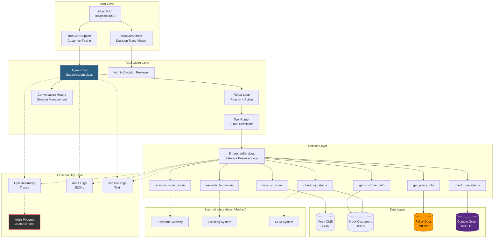
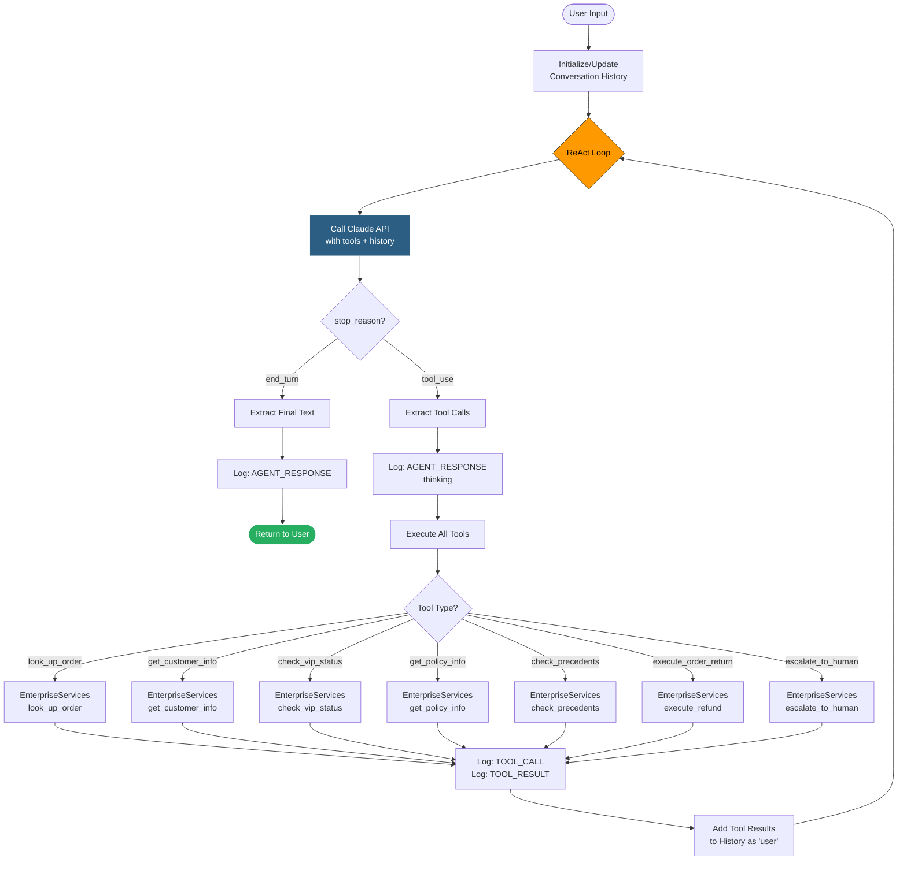
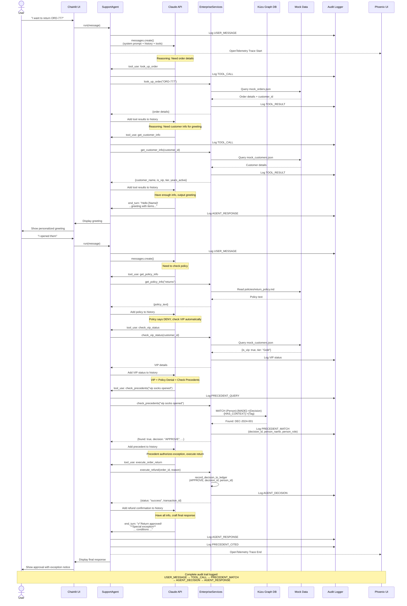
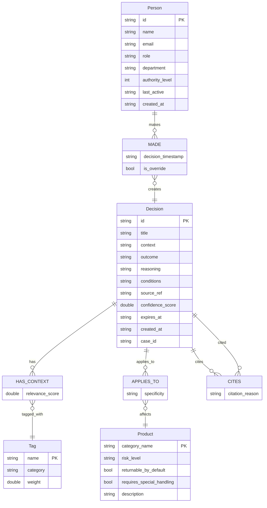
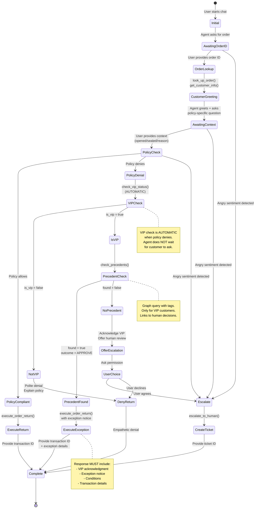
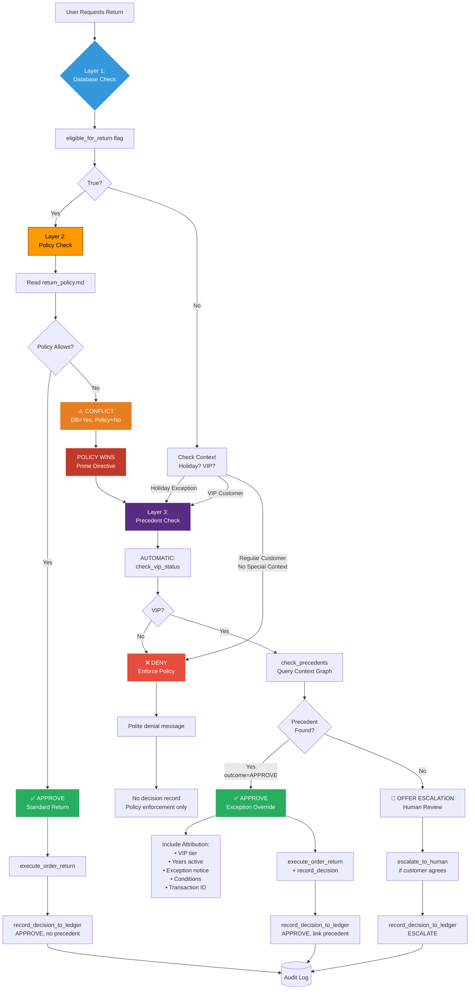

# Architecture Diagrams

## System Architecture Overview



## ReAct Loop Flow



## Data Flow - Complete Request Lifecycle



## Precedent Matching Flow

```mermaid
flowchart TD
    Start([Agent detects:<br/>VIP + Policy Denial]) --> CallTool[Tool: check_precedents<br/>query_tags_str]

    CallTool --> ParseTags[Parse Tags<br/>Split by space<br/>Convert to lowercase]
    ParseTags --> Example["Example:<br/>'vip socks return exception'<br/>→ ['vip', 'socks', 'return', 'exception']"]

    Example --> GraphQuery[Graph Query:<br/>MATCH Person-Decision-Tag]

    GraphQuery --> FilterQuery{Apply Filters}
    FilterQuery --> Filter1[Tag IN input_tags]
    FilterQuery --> Filter2[expires_at = 'NEVER'<br/>OR expires_at > now]
    FilterQuery --> Filter3[confidence_score >= 0.7]

    Filter1 --> Aggregate[Aggregate:<br/>SUM relevance_scores<br/>per Decision]
    Filter2 --> Aggregate
    Filter3 --> Aggregate

    Aggregate --> Sort[Sort BY:<br/>1. match_score DESC<br/>2. authority_level DESC]

    Sort --> Limit[LIMIT 1<br/>Best match only]

    Limit --> HasResults{Results?}

    HasResults -->|Yes| Extract[Extract:<br/>• decision_id<br/>• decision_title<br/>• outcome APPROVE/DENY<br/>• reasoning<br/>• conditions<br/>• person_name<br/>• person_role<br/>• authority_level<br/>• match_score<br/>• confidence]

    Extract --> AuditMatch[Log: PRECEDENT_MATCH<br/>session_id, decision_id,<br/>person details]

    AuditMatch --> ReturnFound[Return:<br/>{found: true, ...}]

    HasResults -->|No| AuditNoMatch[Log: NO_PRECEDENT<br/>session_id, query_tags]

    AuditNoMatch --> ReturnNotFound[Return:<br/>{found: false}]

    ReturnFound --> AgentDecision{Agent Decision}
    ReturnNotFound --> AgentDecision

    AgentDecision -->|found=true<br/>outcome=APPROVE| ApplyException[Apply Exception:<br/>execute_order_return]
    AgentDecision -->|found=false| OfferEscalate[Offer Escalation:<br/>Human review needed]

    ApplyException --> RecordDecision[record_decision_to_ledger<br/>Link to precedent]
    OfferEscalate --> MaybeEscalate[escalate_to_human<br/>if customer agrees]

    RecordDecision --> End([End])
    MaybeEscalate --> End

    style GraphQuery fill:#5a2b82,stroke:#fff,color:#fff
    style AuditMatch fill:#27ae60,stroke:#fff,color:#fff
    style AuditNoMatch fill:#e74c3c,stroke:#fff,color:#fff
    style ApplyException fill:#27ae60,stroke:#fff,color:#fff
```

## Graph Database Schema



## Conversation State Machine



## Multi-Layered Governance



## Tool Execution Flow

```mermaid
flowchart LR
    subgraph "Mandatory Sequence"
        T1[1. look_up_order<br/>MANDATORY FIRST]
        T2[2. get_customer_info<br/>MANDATORY SECOND]
        T3[3. Output Greeting<br/>STOP & WAIT]
    end

    T1 --> T2 --> T3

    subgraph "After Customer Response"
        T4[4. get_policy_info<br/>Before decisions]
    end

    T3 -.->|User responds| T4

    subgraph "Conditional Tools"
        T5{Policy Denies?}
        T6[check_vip_status<br/>AUTOMATIC]
        T7{is_vip?}
        T8[check_precedents<br/>Only for VIPs]
    end

    T4 --> T5
    T5 -->|Yes| T6
    T5 -->|No| Decision
    T6 --> T7
    T7 -->|Yes| T8
    T7 -->|No| Decision
    T8 --> Decision

    subgraph "Action Tools (Mutually Exclusive)"
        A1[execute_order_return<br/>✅ Approve]
        A2[escalate_to_human<br/>🎫 Escalate]
        A3[Text Only<br/>❌ Deny]
    end

    Decision{Decision} --> A1
    Decision --> A2
    Decision --> A3

    subgraph "Post-Action"
        L1[record_decision_to_ledger<br/>Audit trail]
        L2[Log: AGENT_DECISION]
    end

    A1 --> L1 --> L2
    A2 --> L1 --> L2

    style T1 fill:#e74c3c,stroke:#fff,color:#fff
    style T2 fill:#e74c3c,stroke:#fff,color:#fff
    style T3 fill:#e74c3c,stroke:#fff,color:#fff
    style T6 fill:#f39c12,stroke:#fff,color:#fff
    style A1 fill:#27ae60,stroke:#fff,color:#fff
    style A2 fill:#3498db,stroke:#fff,color:#fff
    style A3 fill:#95a5a6,stroke:#fff,color:#fff
```


